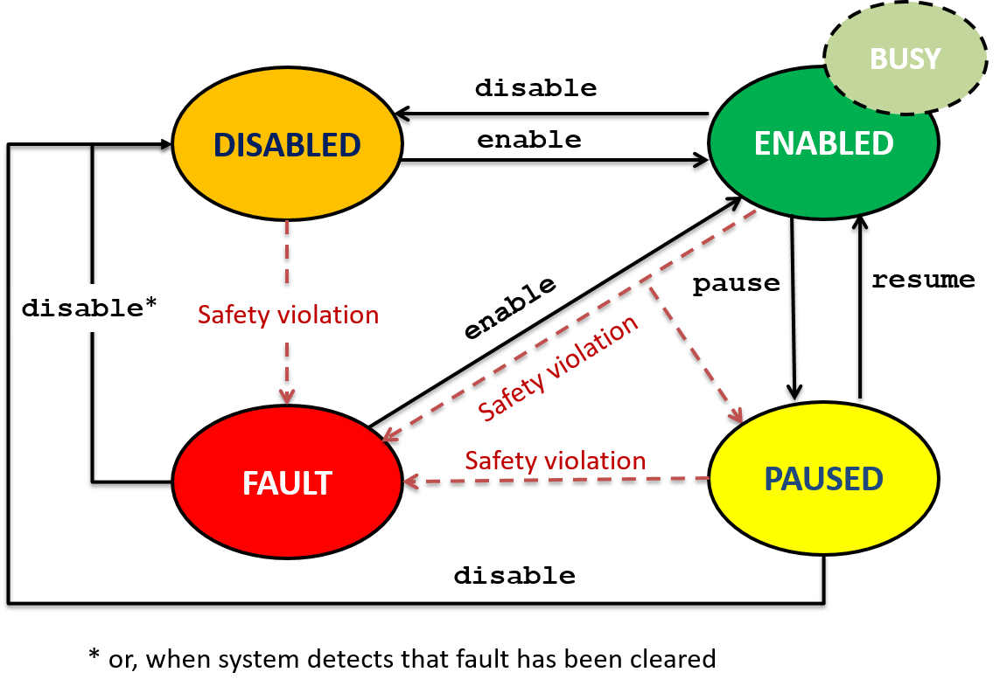

Overview
++++++++

A robot controller often includes a state machine to manage different
phases of robot operation. CRTK does not mandate the use of a state
machine, but there are some basic states that apply to most, if not
all, robots. We call these *meta-states*. Thus, CRTK defines commands to
initiate transitions from one meta-state to another and to query the
current meta-state. In addition, we specify queries whether the robot
is homed and/or busy.

Robot Meta-States
+++++++++++++++++

The four robot *meta-states* (hereafter called states) are illustrated
in the following notional state machine:

For clarity, all state names are UPPER-CASE and commands to
transition between states are lower-case. Although not shown in the
figure, state queries are also represented in lower-case. In addition,
the figure above shows the BUSY mode, which indicates that the
robot is busy completing a specified action (only relevant in the
ENABLED state). The HOMED mode is not shown, but is relevant
to all states. See the queries ``is_homed`` and ``is_busy`` described
below.

The following subsections describe the states.

DISABLED
++++++++

In this state, the drive (motor) power is disabled. This is typically
the initial state of the robot. If, however, there is a fault
condition that would prevent the robot from being powered on (via the
enable command), the system should transition to the FAULT state.

ENABLED
+++++++

In this state, the motor power is enabled and the robot is able to
move. We identify the BUSY operating mode, which indicates that a
command is active (see ``is_busy`` query). Application software may also
wish to query the ``is_homed`` mode, since robots that require homing
will typically allow limited motions when ``is_homed`` is False. For
example, in this mode the robot can perform homing motions, such as
moving until a limit switch is encountered, or it may be able to make
relative motions in joint space. Note that specific robot
implementations may have several states in this category; for example,
a separate state for each motion type.

PAUSED
++++++

In this state, the motor power is enabled, but the robot cannot be
moved. The system transitions to this state in response to a pause
command or some types of safety violations. Exiting this state
requires an explicit command, such as resume to return to the ENABLED
state.

Not all robot systems will natively support a PAUSED state, but
this can be implemented in the interface layer by rejecting certain
commands (e.g., motion commands) when the system is in this state.

This state could also be used to indicate that the interface no longer
has control of the robot; for example, if pre-empted by another
controller, such as a teach pendant.

FAULT
+++++

The robot enters the FAULT state when a fault condition (safety
violation) causes the motor power to be disabled. If the robot system
is able to monitor the fault condition, the system will remain in this
state until the fault is cleared; once cleared, the system transitions
to the DISABLED state.

If the system cannot monitor the fault condition, there are two
implementation choices:

#. The system can transition to the DISABLED state (instead of
   FAULT), which indicates that motor power is disabled, but there
   is no known fault condition.

#. The system can remain in the FAULT state until the application
   software issues a disable or enabled command, at which time the
   system can attempt to transition to the DISABLED or ENABLED
   state, respectively.

Note that there is no API command to cause the system to transition to
the FAULT state. If the application software detects a safety
violation, it can use the pause command to stop motion or the disable
command to turn off motor power. The rationale is that the FAULT state
is intended to indicate a persisent fault condition (detected by the
system), whereas the system cannot determine whether an
application-level fault is persistent.

State Transitions
+++++++++++++++++

The following table indicates the state transitions corresponding to
the commands listed in the top row.

.. list-table:: CRTK state transitions
   :widths: 20 20 20 20 20
   :header-rows: 1

   * - **command**

       **STATE**
     - **enable**
     - **disable**
     - **pause**
     - **resume**
   * - **DISABLED**
     - ENABLED
     - DISABLED
     - DISABLED

       (invalid)
     - DISABLED

       (invalid)
   * - **ENABLED**
     - ENABLED
     - DISABLED
     - PAUSED
     - ENABLED
       
       (invalid)
   * - **PAUSED**
     - PAUSED

       (invalid)
     - DISABLED
     - PAUSED
     - ENABLED
   * - **FAULT**
     - ENABLED

       (retry)
     - DISABLED

       (retry)
     - FAULT

       (invalid)
     - FAULT

       (invalid)
   
In addition to the commands in the above table, there is a ``home``
command to initiate the homing sequence and an ``unhome`` command to
reset the home flag.

State Queries
+++++++++++++

Each of the meta-states has a corresponding query command if the robot
is in that state. The state queries are ``is_disabled``, ``is_enabled``,
``is_paused``, and ``is_fault``. They produce the obvious result, which is
that they return True if the robot is in that state and false
otherwise (note that these states are mutually exclusive, so exactly
one will be True at any given time).

In addition, the mode queries are ``is_busy`` and ``is_homed``:

* ``is_busy``: True if the robot is currently executing a
  command. Note that the robot might not be physically moving; for
  example, it may have reached its position destination or it may be
  "moving" at zero velocity. The intent here is to identify cases
  where the application software may wish to wait before sending the
  next command. The recommended behavior is for the move commands to
  set ``is_busy`` True while the motion is in progress, but for the
  interpolate and servo commands to set ``is_busy`` False. The home
  command would also set ``is_busy`` True while the homing motion is
  in progress.

* ``is_homed``: True if the homing process has been completed (should
  return True for a robot that does not require homing).

Based on the above, it is possible to define an ``is_ready`` query
that indicates when the robot is ready to accept motion commands. In
this case, ``is_ready`` would be equivalent to ``(is_enabled &&
is_homed)``. To avoid pre-empting an existing motion, one could check
``(is_enabled && is_homed && !is_busy)``.
