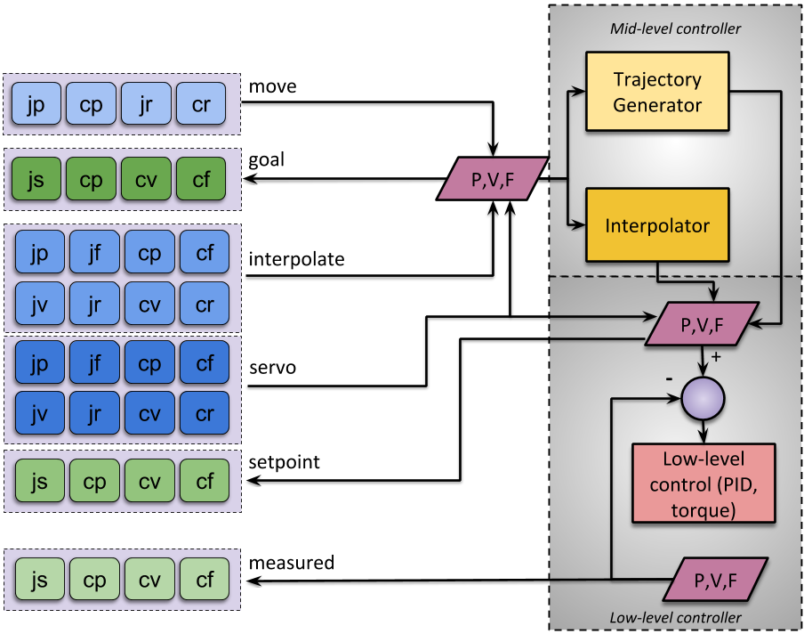

General concepts
================

Motions
-------

We identified the following basic types of motions for collaborative
robotics. All these commands can be defined either in the cartesian or
joint space.

``servo``
^^^^^^^^^

Direct access to the low-level controller:

* **Use cases:**

  * User has a smooth and continuous trajectory coming from a master
    arm or recorded trajectory and can send commands at a high rate.

  * Closing the loop in velocity mode using a fast external sensor
    with a task based Jacobian.

  * Haptic feedback on master arm.

* **Type:** These commands can be either position, velocity or effort
  based. Positions can be provided relative from the latest setpoint
  position.

* **Continuity:** Users should send continuous commands. The low-level
  controller is not required to generate intermediate setpoints to
  ensure that the command is feasible (i.e., setpoint should be close
  to current state). The low-level controller can enforce limits,
  e.g., reject a command if the difference from the previous command
  is greater than a defined threshold.

* **Time:** Users are expected to send commands periodically at a rate
  close to the low-level rate. These commands are preemptive.

``interpolate``
^^^^^^^^^^^^^^^

Simple interpolation:

* **Use cases:**

  * User has a smooth trajectory coming from a master arm or recorded
    trajectory, but **cannot** send commands at a high rate (e.g., 50Hz
    visual tracking, remote tele-operation).

  * In general, similar usage as ``servo`` but the application can not
    send commands fast enough to provide a smooth command so the
    low-level controller needs to interpolate the user commands
    (smooths but adds latency).

* **Type:** These commands can be either position, velocity or effort
  based. Positions can be provided relative from the latest setpoint
  position.

* **Continuity**: Users must send continuous commands. The low-level
  controller will compute intermediary positions to smooth the motion.

* **Time:** Users are expected to send commands periodically at a rate
  lower than the low-level controller. The velocity of the motion is
  defined by the user commands. These commands are preemptive.

Naming convention
-----------------

Command names are based on the space, type and control level. The
prefix identifies the control level (``servo``, ``interpolate`` or
``move``), it is followed by an underscore (``_``) and two letters
identifying the space and type. For example, ``servo_cp`` is a "servo"
command with a cartesian (``c``) position (``p``) setpoint.

Query commands
^^^^^^^^^^^^^^

* Space: ``j`` (joint), ``c`` (cartesian)

* Type:

  * Joint: ``s`` (state: position, velocity and effort)

  * Cartesian: ``p`` (pose), ``v`` (twist), ``f`` (wrench)

* Level:

  * Measured: ``measured`` (physical measure from sensors)

  * Low-level: ``setpoint`` (current servo setpoint)

  * Mid-level: ``goal`` (current interpolate or move goal)

Motion commands
^^^^^^^^^^^^^^^

* Space: ``j`` (joint), ``c`` (cartesian)

* Type: ``p`` (position or pose), ``r`` (relative position or pose),
  ``v`` (velocity or twist), ``f`` (force, wrench or effort)

* Control level: ``servo`` (low-level), ``interpolate`` (basic
  interpolation), ``move`` (full trajectory planning)

Data validity
^^^^^^^^^^^^^

For all query commands, it might be necessary to indicate that the
data is not valid. For all invalid data, the header timestamp should
be set to 0 (recall that the timestamp represents an absolute time
since January 1, 1970).

*ROS Specific*: The header timestamp is the field time
``Header.stamp``. Since it is not necessary to keep publishing
invalid data, it is recommended to not publish on the corresponding
topic until the data becomes valid again. To allow new a ROS node to
detect invalid data, the ROS topic should be latched. See `ROS
publisher options <http://wiki.ros.org/roscpp/Overview/Publishers%20and%20Subscribers#Publisher_Options>`_.

Overview
--------

Table
^^^^^

.. list-table::
   :widths: 20 80
   :header-rows: 1

   * -
     - **Syntax**
   * - Control level
     - ``servo``: direct real-time stream (pre-emptive)

       ``interpolate``: interpolated stream (pre-emptive)

       ``move``: plan trajectory to goal (pre-emptive), monitor with ``is_moving``
   * - Feedback
     - ``measured``: sensor feedback

       ``measuredN``: redundant sensor feedback (N=2, 3...)

       ``setpoint``: current setpoint to low-level controller

       ``goal``: most recent ``interpolate`` or ``move`` goal
   * - Space
     - ``j``: joint

       ``c``: cartesian
   * - Type
     - ``p``: position

       ``r``: relative

       ``v``: velocity or twist

       ``f``: generalized force (effort and wrench)

       ``s``: state for joint feedback (includes position, velocity and effort)

Diagram
^^^^^^^

Detailed API
============

General requirements
--------------------

For temporarily unavailable data, set the time ``header.stamp``
to 0. For commands not supported at all by the robot, make sure
the topic is not available.

For all commands (aka topics) using dynamic vectors (e.g
``sensor_msgs/JointState``), all the non-empty dynamic vectors must
have the same size and the size must match the number of joints on the
robot used. If a subset of the information is not available, the
corresponding vector (name, position, velocity or effort) should be
empty, i.e. of size 0.

When using ROS, all query commands related to the robot telemetry
should be implemented as publishers on the robot side.

Query commands
--------------

``measured_js``, measured joint state
^^^^^^^^^^^^^^^^^^^^^^^^^^^^^^^^^^^^^

* Payload: ``sensor_msgs/JointState``

* Specification:
  * ``time header.stamp``: time of measurement [*required*]

  * ``string header.frame_id``: reference frame (this should match the ``header.frame_id`` string in ``measured_cp``) [*required*]

  * ``string name[]``: array of joint names [*required*]

  * ``float64 position[]``: array of measured joint positions [*optional*]

  * ``float64 velocity[]``: array of measured joint velocities [*optional*]

  * ``float64 effort[]``: array of measured joint efforts [*optional*]

* Notes:

  * velocity should be provided if the low-level controller has the ability to perform velocity estimation

  * effort should be provided if the low-level controller has torque sensors or current feedback per joints

``measured_cp``, measured cartesian position
^^^^^^^^^^^^^^^^^^^^^^^^^^^^^^^^^^^^^^^^^^^^

* Payload: ``geometry_msgs/PoseStamped`` (before 01/2022 payload was ``geometry_msgs/TransformStamped``, see #1)

* Specification:

  * ``time header.stamp``: time of measurement, if the measured cartesian position is based on a measured joint position, the time stamp should be the same as ``measured_js`` [*required*]

  * ``string header.frame_id``: reference frame [*required*]

  * ``string frame_id``: moving frame [*not available on ROS*]

  * ``Transform transform``: translation and rotation for the measured cartesian position (e.g. forward kinematics based on measured joint position from ``measured_js``) [*required*]

``measured_cv``, measured cartesian velocity (twist)
^^^^^^^^^^^^^^^^^^^^^^^^^^^^^^^^^^^^^^^^^^^^^^^^^^^^

* Payload: ``geometry_msgs/TwistStamped``

* Specification:

  * ``time header.stamp``: time of measurement, if the measured twist is based on a measured joint velocity, the time stamp should be the same as ``measured_js`` [*required*]

  * ``string header.frame_id``: reference frame, see measured_cp [*required*]

  * ``string frame_id``: moving frame, see measured_cp [*not available on ROS*]

  * ``Twist twist``: linear and angular components for the measured cartesian velocity (e.g. Jacobian applied to measured joint velocities) [*required*]

* Notes:

  * This command will not be available if the low-level controller doesn't have a way to estimate joint velocity.
